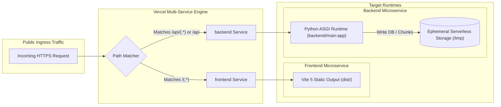
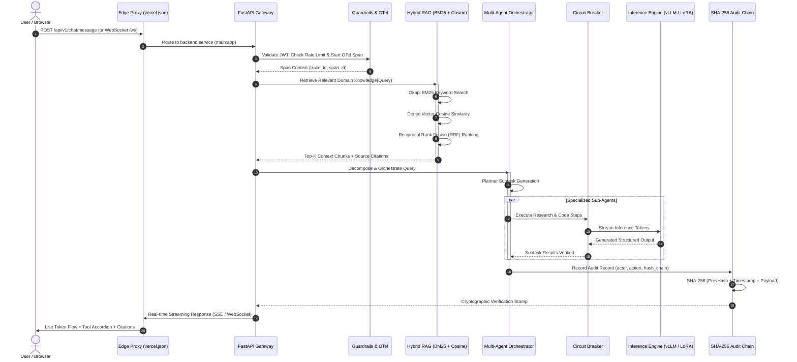
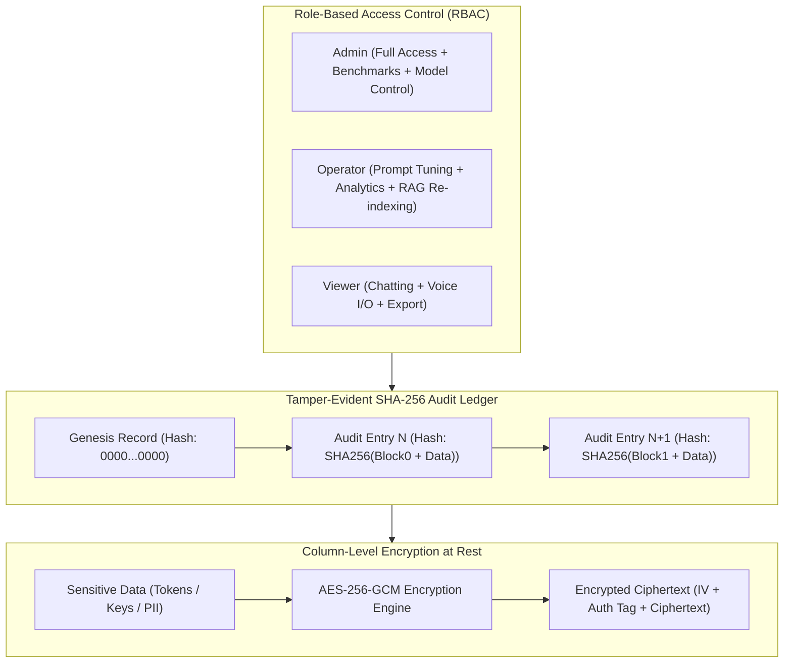

# 🏛️ NexusAI Enterprise System Architecture

Welcome to the comprehensive architectural documentation of **NexusAI**, a production-grade enterprise AI platform engineered with a multi-agent orchestration core, hybrid retrieval-augmented generation (RAG), real-time streaming, cryptographic security, and cloud multi-service deployment.

---

## 🗺️ High-Level System Architecture

```mermaid
flowchart TD
    subgraph Client ["Client Presentation Layer (Browser / WebGL)"]
        User["User Interface"]
        WebGL["Three.js GLSL Custom Shader Neural Canvas"]
        ReactUI["React 18 + Tailwind CSS + Framer Motion"]
        Bento["Bento-Grid Analytics & Telemetry Waterfall"]
        User --> ReactUI
        ReactUI --> WebGL
        ReactUI --> Bento
    end

    subgraph Edge ["Edge Ingress & Reverse Proxy (Vercel / NGINX)"]
        Router{"Reverse Proxy Routing Layer"}
        ReactUI -->|"HTTPS / WSS / SSE"| Router
        Router -->|"/(.*) Static SPA Assets"| ViteService["Frontend Service (Vite React Build)"]
        Router -->|"/api/(.*) REST & WebSockets"| BackendService["Backend Service (Python FastAPI ASGI)"]
    end

    subgraph Backend ["NexusAI Core Backend (Python FastAPI)"]
        API["FastAPI Gateway (backend/main.py)"]
        BackendService --> API

        subgraph SecurityPipeline ["Security, RBAC & Telemetry Pipeline"]
            CORS["CORS Handler"]
            Auth["JWT & RBAC Verifier (Admin / Operator / Viewer)"]
            RateLimit["Rate Limiter (Token Bucket 60 req/min)"]
            OTel["OpenTelemetry Distributed Tracing & W3C Headers"]
            Guardrails["Content Guardrails & PII Masker"]
            API --> CORS --> Auth --> RateLimit --> OTel --> Guardrails
        end

        subgraph IntelligenceCore ["Intelligence & Orchestration Core"]
            Orchestrator["Multi-Agent Orchestrator"]
            RAG["Hybrid RAG Pipeline (BM25 + Dense Cosine + RRF)"]
            CircuitBreaker["Circuit Breaker (Closed / Open / Half-Open)"]
            Inference["LLM Inference Engine (vLLM / PEFT LoRA)"]
            Guardrails --> Orchestrator
            Guardrails --> RAG
            Orchestrator --> CircuitBreaker --> Inference
        end

        subgraph SpecializedAgents ["Specialized Domain Sub-Agents"]
            Planner["Planner Agent (Complexity & Step Decomposition)"]
            Researcher["Research Agent (Vector & Web Search)"]
            Architect["Code Architect Agent (Design & System Specs)"]
            Calculator["Infra & VRAM Sizing Agent (Structured Output)"]
            Orchestrator --> Planner
            Planner --> Researcher
            Planner --> Architect
            Planner --> Calculator
        end
    end

    subgraph DataLayer ["Persistence, Cryptography & Cache Layer"]
        DB[("Database (PostgreSQL / SQLite @ /tmp)")]
        AuditLedger[("Tamper-Evident SHA-256 Audit Chain Ledger")]
        EncryptedData["AES-256-GCM Column-Level Encryption at Rest"]
        Cache[("Redis Cache / In-Memory Fallback")]
        VectorStore[("ChromaDB Vector Store @ /tmp")]

        API --> DB
        DB --> AuditLedger
        DB --> EncryptedData
        API --> Cache
        RAG --> VectorStore
    end
```



---

## ⚡ Multi-Service Cloud Routing (`vercel.json`)

The platform is designed to deploy atomically across both **Serverless Multi-Service** platforms (Vercel) and **Containerized Orchestrators** (Docker Compose, Kubernetes):



### Routing Rules Specification:
- **API Routing**: `/api/(.*)` $\rightarrow$ Routed directly to the Python FastAPI ASGI service. The backend receives the original path preserving API version prefixes (`/api/v1/...`).
- **Static Assets & SPA Routing**: `/(.*)` $\rightarrow$ Catch-all routing delivering compiled HTML, JS, CSS, and GLSL shaders directly from Vite production bundle.
- **Serverless Resilience**: In read-only cloud environments (e.g. AWS Lambda / Vercel Serverless), SQLite and ChromaDB automatically redirect file writes to `/tmp` with defensive `try-except` directory creation.

---

## 🔄 End-to-End Request & Streaming Sequence



---

## 🛡️ Security, Cryptography & Governance Architecture



---

## ⚡ Reliability & Fault Tolerance State Machine

The Circuit Breaker pattern protects the backend from upstream model inference latency spikes and timeouts:

```mermaid
stateDiagram-v2
    [*] --> Closed : System Boot & Initial Health Check
    
    Closed --> Open : Consecutive Failures >= Threshold (5)
    note right of Closed : Normal operation: Requests forwarded to active LLM engine

    Open --> HalfOpen : Recovery Timeout Elapsed (30s)
    note right of Open : Fail-fast active: Requests immediately routed to fallback model

    HalfOpen --> Closed : Probe Requests Succeed (Threshold reached)
    HalfOpen --> Open : Any Probe Request Fails (Reset backoff timer)
```

- **WebSocket Watchdog & SSE Fallback**: The client initiates WebSocket connections with a **3000ms watchdog timer**. If the connection is blocked or times out, the client automatically downgrades seamlessly to Server-Sent Events (SSE) streaming without interrupting the user.
- **Distributed Tracing**: Every request is injected with standard W3C `traceparent` headers, recording span durations across Gateway $\rightarrow$ RAG $\rightarrow$ Agent $\rightarrow$ Database, visualized in an interactive React waterfall timeline.

---

## 📦 Deployment Topology Comparison

| Feature | Vercel Multi-Service (Serverless) | Docker Compose (Self-Hosted) | Kubernetes (EKS / GKE) |
|---|---|---|---|
| **Frontend Runtime** | Edge CDN (Global Static Delivery) | NGINX Container (`:3000`) | NGINX Ingress + Pods |
| **Backend Runtime** | Python 3.10+ ASGI Serverless Function | Uvicorn Multi-Worker (`:8000`) | FastAPI Deployment + HPA |
| **Database** | SQLite @ `/tmp/nexus.db` / Managed Postgres | PostgreSQL 16 Container | StatefulSet / Amazon RDS |
| **Cache & Queue** | In-Memory Cache Fallback | Redis 7 Container | Redis Cluster StatefulSet |
| **Routing** | `vercel.json` Multi-Service Rewrites | NGINX Reverse Proxy | Ingress Controller (ALB / Traefik) |
| **Scaling** | Instant Zero-to-One Serverless | Vertical / Docker Swarm | Horizontal Pod Autoscaler (HPA) |

---

*Authored for NexusAI Enterprise Platform — Maintained in [`aziz04076/AI-Chatbot`](https://github.com/aziz04076/AI-Chatbot).*
