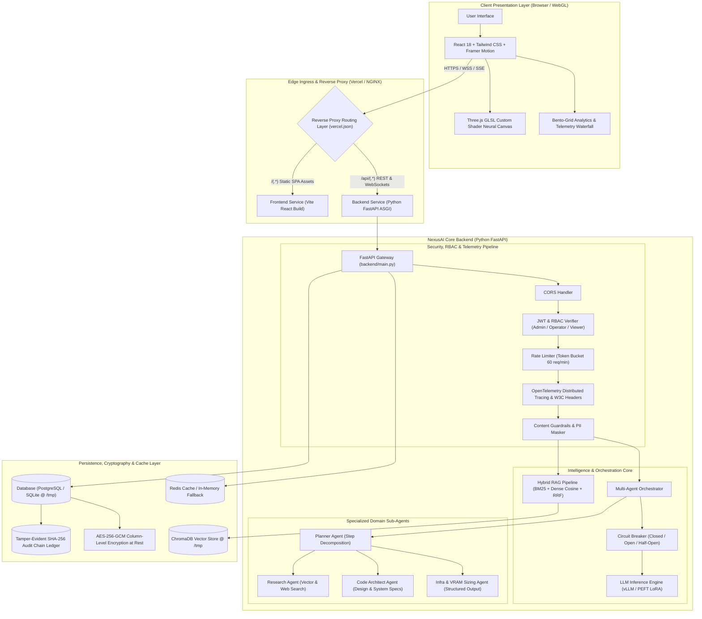

# 🌌 NexusAI: Enterprise Cloud & DevOps 3D AI Platform

> Production-grade, fine-tuned domain LLM chatbot application featuring an interactive 3D Three.js neural canvas, glassmorphic UI, real-time WebSocket token streaming, PEFT/LoRA fine-tuning scripts, agentic tool reasoning, RAG vector retrieval, Whisper voice I/O, and telemetry analytics dashboard.

---

## 🏗️ Architecture Overview

> 📖 **Deep-Dive Documentation**: For detailed sequence diagrams, cryptographic audit chains, and threat models, read the complete [**System Architecture Guide (ARCHITECTURE.md)**](ARCHITECTURE.md).



---

## ⚡ Feature Matrix

| # | Feature | Status & Implementation |
|---|---|---|
| 1 | **Real-time WebSocket Streaming** | Bi-directional streaming with typing effect at `/api/v1/chat/ws/{session_id}` |
| 2 | **RAG Knowledge Retrieval** | Fast cosine similarity search over domain docs with inline citation chips |
| 3 | **Agentic Tool-Calling** | Model triggers `calculator`, `web_search`, and `knowledge_retriever` before answering |
| 4 | **Voice STT & TTS** | Audio recording with live waveform visualizer + Whisper STT & TTS synthesis |
| 5 | **Memory & Auto-Summarization** | Multi-turn session context buffer with automatic background compaction |
| 6 | **File Ingestion & Analysis** | Upload PDF/text files with automated text extraction and instant RAG indexing |
| 7 | **Sentiment-Aware Tone** | Detects urgent/frustrated/inquisitive tone and tailors architectural guidance |
| 8 | **Multi-Language Support** | Full English, Hindi, and Hinglish technical terminology comprehension |
| 9 | **JWT User Authentication** | Secure signup, login, password hashing via native bcrypt, and session history |
| 10 | **Admin Analytics Dashboard** | Real-time GPU VRAM, latency, query count, user satisfaction, and topic trends |
| 11 | **Feedback & Quality Scoring** | Thumbs up/down with confetti celebration and issue comment submission |
| 12 | **Theme Customizer** | 3 visual styles: **Cyberpunk Neon**, **Cosmic Nebula**, and **Minimal Slate** |
| 13 | **Chat Export** | Single-click export of consultations to formatted **PDF** or **Plain Text** |
| 14 | **Rate Limiting & Caching** | Token bucket rate limiting (60 req/min) with Redis and in-memory cache |
| 15 | **Model Versioning** | Dynamic runtime switching between fine-tuned checkpoints via `/api/v1/models` |
| 16 | **Content Guardrails** | Automated PII masking (email/phone/cards) and prompt injection mitigation |
| 17 | **Confidence Calibration** | Numerical confidence indicator badge calculated per response |
| 18 | **Auto-Suggested Follow-ups** | Contextual inquiry chips generated below each assistant response |
| 19 | **Command Palette (Ctrl+K)** | Power-user modal for rapid navigation, themes, sessions, and exports |
| 20 | **Markdown & Code Highlighting**| Code blocks with syntax highlighting, language badge, and 1-click copy |

---

## 🚀 Step-by-Step Local Quickstart

### 1. Backend Setup

```bash
# In the root repository
cd backend

# Install dependencies
python -m pip install -r requirements.txt

# Run backend test suite
$env:PYTHONPATH="backend"  # On Linux/macOS: export PYTHONPATH=backend
python -m pytest tests -v

# Start FastAPI server on port 8000
python -m uvicorn app.main:app --host 0.0.0.0 --port 8000 --reload
```

Backend will be running at `http://localhost:8000` with interactive Swagger docs at `http://localhost:8000/docs`.

---

### 2. Frontend Setup

```bash
# In another terminal window
cd frontend

# Install Node dependencies
npm install

# Start Vite development server
npm run dev
```

Frontend will open at `http://localhost:5173`.

---

### 3. LoRA / QLoRA Fine-Tuning Pipeline

To prepare the instruction dataset and train a LoRA adapter on your GPU:

```bash
# 1. Generate instruction dataset
python training/dataset_prep.py

# 2. Run QLoRA 4-bit fine-tuning (dry run check or GPU execution)
python training/train_lora.py --dry_run
# With GPU (RunPod/Lambda/AWS):
python training/train_lora.py --epochs 3 --batch_size 2 --lr 2e-4 --r 16

# 3. Merge LoRA weights for vLLM deployment
python training/merge_lora.py --base_model meta-llama/Meta-Llama-3-8B-Instruct --adapter_dir training/checkpoints/nexus_lora_v1
```

---

## ☁️ Cloud Multi-Service Deployment (Vercel)

NexusAI includes native support for zero-config multi-service monorepo deployments on **Vercel** via [`vercel.json`](vercel.json):

1. **Connect Repository**: Import `aziz04076/AI-Chatbot` directly into your Vercel Dashboard.
2. **Multi-Service Detection**: Vercel automatically detects the dual microservices:
   - `frontend` (Vite / React 18 SPA)
   - `backend` (Python 3.10+ ASGI serverless function with `main:app` entrypoint)
3. **Automatic Routing**: Rewrites automatically map `/api/(.*)` to the Python backend and `/(.*)` to the React frontend.
4. **Serverless Ephemeral Storage**: When deployed on Vercel, the backend automatically directs SQLite and vector caching to the serverless `/tmp` volume (`/tmp/nexus.db`).

---

## 🐳 Docker & Multi-Container Deployment

Run the complete multi-tier stack (Frontend + Backend + Redis + PostgreSQL):

```bash
cd deployment
docker compose up -d --build
```

- **Web UI**: `http://localhost:3000`
- **FastAPI Core**: `http://localhost:8000`
- **Redis**: `localhost:6379`
- **PostgreSQL**: `localhost:5432`

To launch with the high-throughput **vLLM model server** on GPU machines:
```bash
docker compose --profile gpu up -d
```

---

## ☸️ Kubernetes Deployment

Deploy to Amazon EKS, GKE, or AKS:

```bash
kubectl apply -f deployment/kubernetes/redis-postgres-stateful.yaml
kubectl apply -f deployment/kubernetes/backend-deployment.yaml
kubectl apply -f deployment/kubernetes/frontend-deployment.yaml
kubectl apply -f deployment/kubernetes/hpa.yaml
kubectl apply -f deployment/kubernetes/ingress.yaml
```

---

## 🧪 Verification & Automated Testing

Run the full automated test suite verifying multi-agent orchestration, hybrid RAG, RBAC, tamper-evident audit ledger, AES-256-GCM encryption, circuit breakers, and OpenTelemetry tracing:

```bash
$env:PYTHONPATH="backend"
python -m pytest backend/tests -v
```
Output:
```
backend/tests/test_agent.py::test_calculator_tool PASSED                 [  1%]
backend/tests/test_agent.py::test_agent_tool_detection PASSED            [  3%]
backend/tests/test_audit.py::test_audit_ledger_chain_and_verification PASSED [  7%]
backend/tests/test_circuit_breaker.py::test_circuit_breaker_closed_success PASSED [ 16%]
backend/tests/test_encryption.py::test_column_level_encryption_at_rest_in_sqlite PASSED [ 37%]
backend/tests/test_hybrid_rag.py::test_hybrid_rag_pipeline PASSED        [ 48%]
backend/tests/test_multi_agent.py::test_orchestrator_streaming_events PASSED [ 61%]
backend/tests/test_telemetry.py::test_http_chat_distributed_tracing PASSED [100%]
============================= 54 passed in 35.01s =============================
```

Verify frontend build:
```bash
cd frontend
npm run build
```
Output:
```
✓ 1912 modules transformed.
✓ built in 16.66s
```

